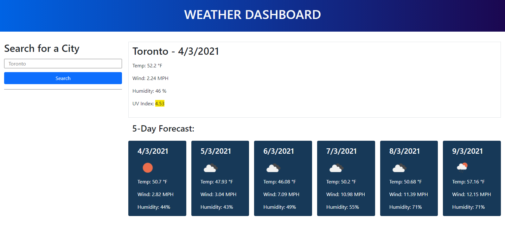

# quick-code-quiz

## Purpose
Timed code quiz that deduct time from timer when user answer the question wrong. It also uses local storage to store score and user is able to see it when clicked on high Score button

## Built With
* HTML
* CSS
* JavaScript

## Features include

## Screencapture of progess anf final app screens

## Website
(https://chaitalizn.github.io/quick-code-quiz/)

## By
Chaitali Patel
